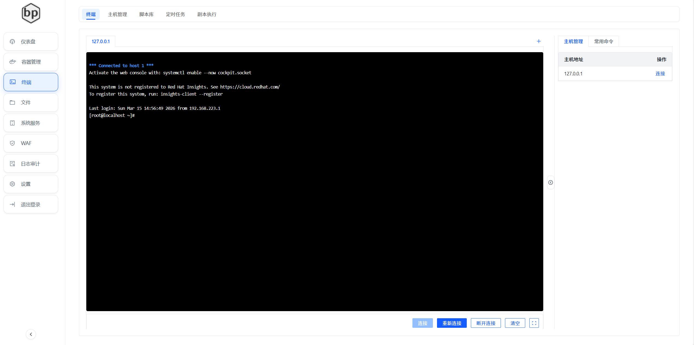
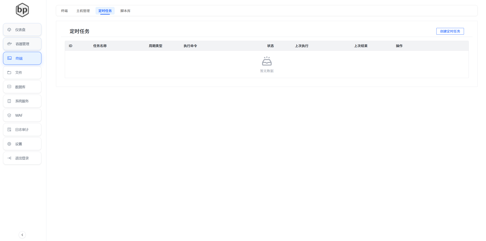
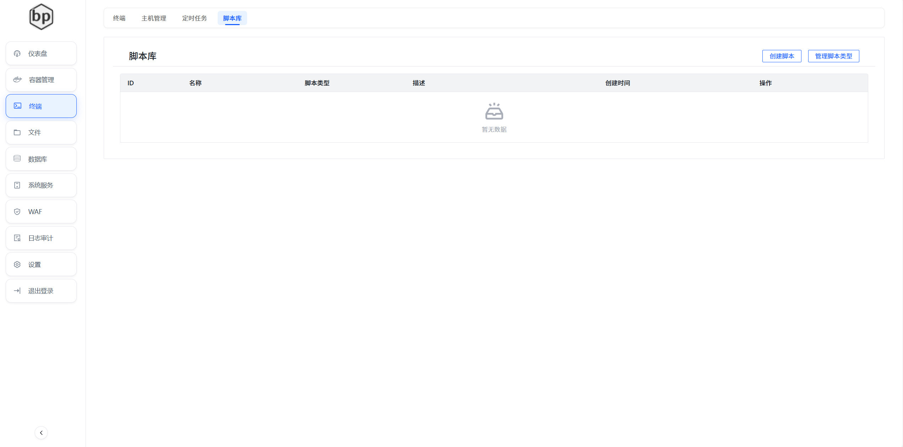
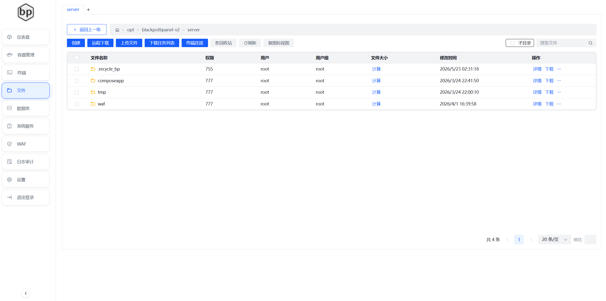
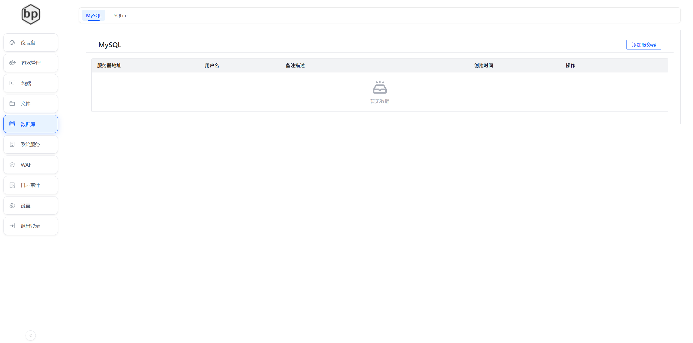
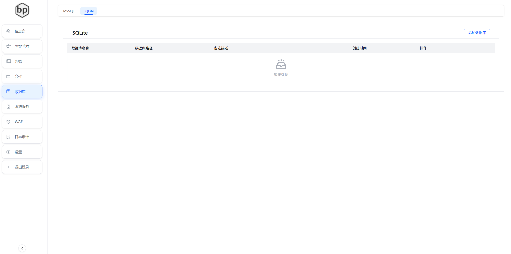
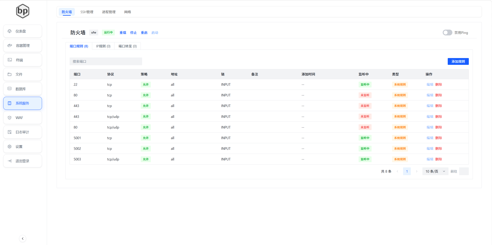
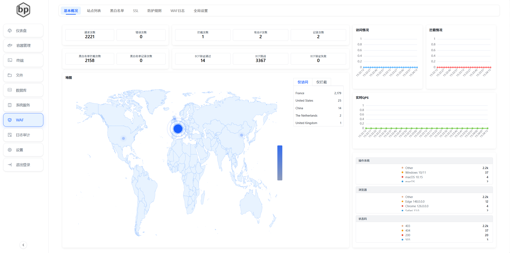

# BlackPotBPanel V2
BlackPotBPanel 是一款使用AI仿照BT面板基于vue+fastapi开发的linux管理面板，写的比较垃圾，只实现了一些基本功能，后续可能会继续完善。

## 演示环境
(https://demo.panel.blackpotbp.cc)
账号：admin
密码：admin@123

## 环境要求
- Python 3.10 及以上版本
- 操作系统支持
--------------
| 操作系统 | 是否支持 | 
|-----|-----|
| Ubuntu 22.04 | ✅ |
| RedHat 8 | ✅ |
| Rocky Linux 9 | ✅ |
| Debian 12.0 | ✅ |
| CentOS 8 | 待测试 |
| AlmaLinux 8+ | 待测试 |
--------------
其余操作系统可尝试手动安装

 
## 一键安装脚本

### 国内
```bash
bash -c "$(curl -sSL https://gitee.com/ssgghshs/blackpotbpanel-v2/raw/master/install/install.sh)"
```

### 国外
请确保已添加github的镜像加速，否则会报错
```bash
bash -c "$(curl -sSL https://raw.githubusercontent.com/ssgghshs/blackpotbpanel-v2/master/install/install2.sh)"
```

## 手动安装
请提前安装python3.10及以上版本，并创建好python的虚拟环境

### 前端
请提前安装nodejs 18及以上版本
1. 克隆仓库
```bash
cd blackpotbpanel-v2/web
```
2. 安装依赖
```bash
npm install
```
3. 运行项目
```bash
npm run dev
```
4. 打包到后端运行
```bash
npm run build
```
将dist文件的内容复制到backend目录下的web目录下，使用
__init__.py.prod文件将
__init__.py.prod改为__init__.py

``` bash
mv ./dist /opt/blackpotbpanel-v2/backend/
```


### 后端
1. 克隆仓库
```bash
git clone https://gitee.com/ssgghshs/blackpotbpanel-v2.git
cd blackpotbpanel-v2/backend
```
2.创建python虚拟环境
```bash
cd /opt/blackpotbpanel-v2
python3 -m venv venv
```

2. 安装依赖
```bash
cd /opt/blackpotbpanel-v2/backend
../venv/bin/pip install -r requirements.txt
```
3. 临时运行项目
```bash
../venv/bin/python main.py
```
4. 永久运行项目
```bash
cp Blackpotbpanel.service /etc/systemd/system/
systemctl daemon-reload
systemctl enable Blackpotbpanel
systemctl start Blackpotbpanel
```


## 功能
- 简洁易用的可视化操作界面
- 登录功能

- 首页功能

- 容器管理，仅支持docker

- 终端功能

- 定时任务

- 脚本库

- 文件管理

- 数据库管理


- 系统服务


- WAF管理

- 日志管理

- 系统设置


## 待完善功能
- 数据库管理，需要新增支持postgresql/redis/mongodb,以及mysql/sqlite的管理功能的完善
- WAF管理，有待重构，以及地区限制功能
- 防火墙/SSH管理需要新增接入Fail2ban

## 待新增功能
- 文件对传功能需要新增
- 操作日志功能需要新增


## 国际化
- 支持中文/英文/日文/韩文


